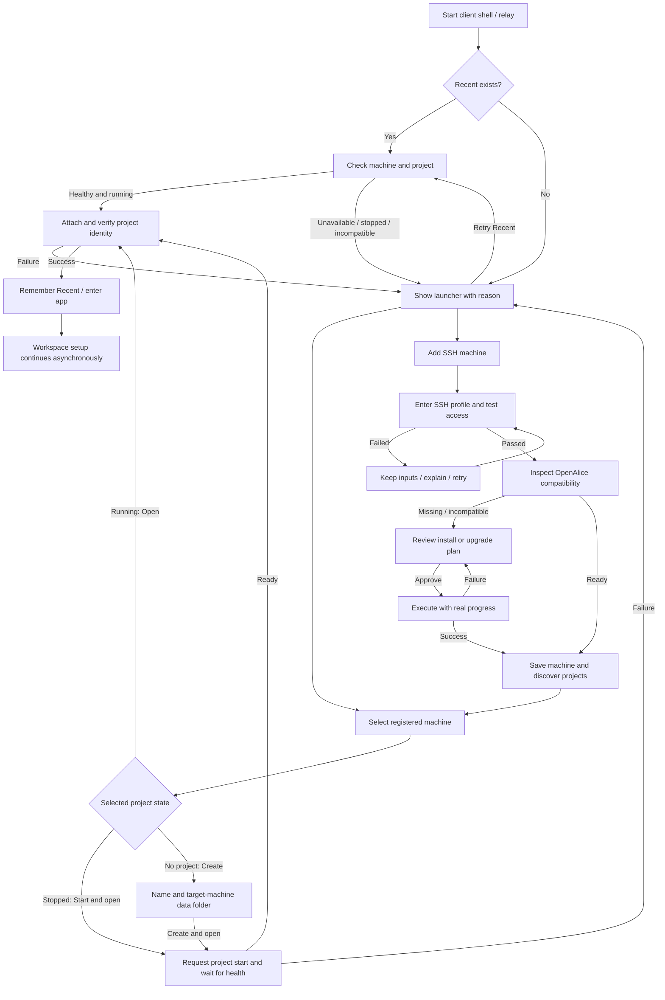

# Startup location guide

Status: active. Selected visual direction: B, a Machine / AliceProject
two-column selector; use C's contextual failure notice when the saved default
cannot be reached. The maintainer selected this direction after reviewing three
generated visual concepts. The old first-run wizard is retired independently
of this replacement.

Owner guides: [[docs/alice-project.md]], [[docs/cli-supervisor.md]],
[[docs/remote-access.md]], [[docs/data-locations.md]],
[[docs/ui-interaction-and-motion.md]], [[docs/managed-workspace-runtime.md]].

## Product contract — revised 2026-09-30

Maintainer decisions: retain B's Machine / AliceProject layout, include SSH
machine addition directly in the launcher, and use **Recent** as the default.
The last successfully opened Machine/AliceProject pair is the next startup
target. There is no separate pinned-default preference or make-default checkbox.
Selecting a row, probing, saving a machine, or a failed open never changes Recent.
A successful switch from Settings updates Recent by the same rule. A transient
disconnect does not erase it. If persistence fails after a successful attachment,
keep the working attachment and show a retryable “Could not remember this
location” notice rather than reporting that opening the project failed.

Recent belongs to the local client/relay control plane, outside AliceProject.
Tabs using one relay share it. An independent client does not inherit another
client's choice through a cloud project. Resolve saved stable machine/project
identity, not display names or ephemeral ports; renamed entries retain identity.
Deleted or unavailable targets remain an explained recovery case.

Start the client shell and control plane first. Check Recent before starting or
attaching a project runtime. Healthy running targets open automatically. Missing
Recent, unreachable machines, stopped/missing projects, incompatible backends,
and unreadable preferences show the launcher. Never silently choose local.
A stopped remote or CLI Recent offers an explicit **Start and open** action.
Electron starts its owned local Recent in integrated mode on each launch; this
is normal local application startup, not a silent fallback. Electron remote
startup must not acquire the local project lock or spawn its backend. Selecting
local in Electron retains integrated IPC; browsers remain separated.

## Flow

SSH access, OpenAlice readiness, and project readiness are separate checks.
Machine registration is not project creation. Existing ownership must be
respected; this flow never silently takes over an occupied project. A machine
is saved only after approved preparation succeeds; a failed test alone must
not register it.

## Screens and actions

| Surface | Content | Primary action / result |
|---|---|---|
| Choose location | Machine left, AliceProject right, Recent badge, persistent Add SSH machine; retry banner if needed | Open project; disabled until verified running |
| Add SSH machine | Name, SSH host or config alias, optional user/port overrides, existing SSH authentication mechanism, advanced options | Test SSH; preserves fields on failure |
| Inspect machine | SSH access → OpenAlice → project discovery, real phase status, stable row placeholders | Back to locations; completed machine becomes selectable |
| Prepare machine | Exact target, current/target version and channel, install/upgrade steps and effects | Explicit Install or Upgrade; progress replaces review in the same surface |
| Create project | Name and path on selected machine; backend validates destination without overwriting existing contents | Create and open; no startup delay for later Workspace setup |
| Stopped project | Machine/project identity and Stopped state; any conflicting ownership explained | Start and open, then actual health check |
| Opening | Selected destination and actual connect/start phase | Prevent duplicate target mutations until the operation settles |
| Recovery | Failed phase, safe human-readable reason, retry/edit/select-other actions | Retry only failed operation where safe; preserve Recent and inputs |

Host-key verification uses the existing SSH trust mechanism. If GUI confirmation
is needed, display the host and fingerprint explicitly; never automatically trust
unknown or changed keys. Authentication capabilities must match the existing
controller; the mock does not authorize introducing password storage. Remote
paths are remote paths, not local OS file picker destinations.

Installation/upgrade execution uses the existing lifecycle service and its
compatibility planning, not a second installer. Leaving a read-only discovery
screen is safe. During an installation or project mutation, retain visible
progress and block conflicting actions; only expose Cancel when cancellation is
actually supported. A lost transport is not proof the remote operation stopped:
reconcile status before allowing a duplicate execution.

## Visual and interaction contract

A full-window launcher with one content viewport; Back replaces the current
step within this shell. No nested dialogs. Two columns at desktop width, machine
then project drill-in on narrow screens. Header/footer stay reachable while the
body scrolls, including short windows and long names. No horizontal overflow.
Use existing theme tokens and shared buttons/forms/selection/status primitives.

Discovery shows phase labels, an indeterminate indicator and reserved skeleton
rows, never a fabricated percentage. Implement per-phase status only when the
controller reports it; until then show one honest “Checking machine” phase.
Keep cached rows visible but label their availability as unverified. Failed or
unverified projects cannot show Running or an enabled Open button.

Keyboard selection and Back navigation preserve sensible focus; forms have
labels and associated errors. Announce progress politely and errors once.
Reduced motion replaces moving indicators with static state text. State must
remain understandable without color. Do not animate the entire launcher.

Settings shows “Next launch: last opened project” alongside the current location.
Switching successfully updates this value automatically. Remove the earlier
“Use current location at startup” and “Make this my default” controls.

## Shared ownership

One client-side domain hook consumes the relay/Desktop controller's state and
requests actions. Presentation is prop-driven. The controller owns discovery,
Recent persistence, operation serialization and connect state. The backend owns
project creation/start/data access. The same operations serve startup, Settings,
and TUI; UI pages must not create independent SSH or probe loops.

## Design boards

Two preview boards were generated with the built-in imagegen tool. They extend
the selected B direction rather than asking the maintainer to choose a new style.

- Board 1: Choose location / Add SSH / Checking.
- Board 2: Prepare machine / Create project / Recovery.

Mock corrections that are authoritative for implementation: Board 1's first
screen mistakenly combines an unavailable banner with Running/Open; use Board
2's recovery state instead. Hardware inventory and directory picker icons are
illustrative, not additional feature commitments. Do not promise three specific
Workspaces in creation copy; the actual project configuration owns that count.
The mock OS title bar is Electron-only; browser content must not fake one.

## Acceptance scenarios

1. First launch without Recent shows local/registered machines and Add SSH.
2. Healthy Recent reopens without asking; no unnecessary local backend starts.
3. Offline, deleted, stopped and incompatible Recent each provide recovery.
4. Click/select/test/cancel never replaces Recent; successful open does.
5. SSH add handles auth/host-key/timeout/install/discovery failures without
   losing input or fabricating a running project.
6. Stopped and absent projects offer explicit start/create actions, respecting
   locks and path safety, followed by non-blocking Workspace initialization.
7. Multiple relay tabs observe the same completed selection; stale operations
   cannot overwrite a newer attachment or Recent.
8. Browser and Electron, narrow/short windows, keyboard and reduced-motion
   states preserve access to actions and errors.

## Delivery sequence

- [x] Review the real startup routes and retire the legacy first-run wizard,
  developer mock page, wizard translations, and wizard-only flags. Preserve an
  isolated fresh-user smoke against real product readiness.
- [x] Compare three generated launcher layouts and record the maintainer's B
  selection and C-style failure treatment.
- [x] Add one client-owned persisted Recent target contract, probe/attach
  state machine, and restart-safe tests. Establish the shipped state boundary
  before deciding whether a migration is needed.
- [x] Apply the contract to browser relay and Electron startup; ensure remote
  Electron defaults skip local project process ownership.
- [x] Build the selected full-window launcher and Settings Recent display on
  a shared domain hook and existing UI primitives.
- [x] Verify healthy, absent, offline, stopped, incompatible, and failed
  connect cases in browser and packaged Electron; update owner guides.

Verification: targeted client/desktop/UI tests, root and UI typechecks,
relevant system/package smoke, and real route inspection. Completion requires
the old wizard to be absent, a durable last-successful-location memory in both
clients, no silent local fallback, and a usable recovery surface.

## Implementation and acceptance — 2026-09-30

The client-owned `startup-target.json` is a new, previously unshipped contract;
no migration or alternate read shape is needed. Relay, TUI and Electron share
its validation and persistence. Successful desktop navigation precedes Recent
persistence. Single-use machine approvals and project operations serialize in
the control plane; adding a Machine only prepares its CLI, never implicitly
starts or takes over a project. GUI creation requires an empty absolute folder.
The shared Machine hook also serves the update provider, with stale-probe and
failed-approval handling rather than another installer lifecycle.

Evidence:
- Full hermetic suite: 864 files / 7,400 tests passed before final integration;
  new project-environment validation specs passed separately.
- Root, UI, CLI and desktop typechecks passed; native desktop bundle built.
- Real isolated source relay: created, started and opened a project, recorded
  Recent, then restarted the relay and automatically returned to that project.
- Real unsigned macOS package: no Recent and unavailable Recent remained in
  the chooser with client-only IPC and no local runtime ownership. Fresh-user
  smoke opened the normal app in lite mode, prepared Chat asynchronously and
  inspected managed Pi readiness without the old wizard.
- Guardian recovery, existing-owner desktop and Docker SSH/remote system gates
  passed. The compiled-release smoke now explicitly selects its initial project
  rather than assuming the removed local fallback.
- Real browser: desktop and 390px layouts, stopped-project selection, empty
  creation, SSH probe Back/late-result handling and fixed footer reachability.
  Narrow mode has no horizontal overflow and transfers keyboard focus between
  the machine and project panels. Loading respects reduced-motion styles.

Unsigned macOS acceptance does not establish Windows/Linux native packaging or
unknown-host interactive SSH trust acceptance. Trust continues to be handled by
the existing SSH mechanism; no host-key bypass or password storage was added.
